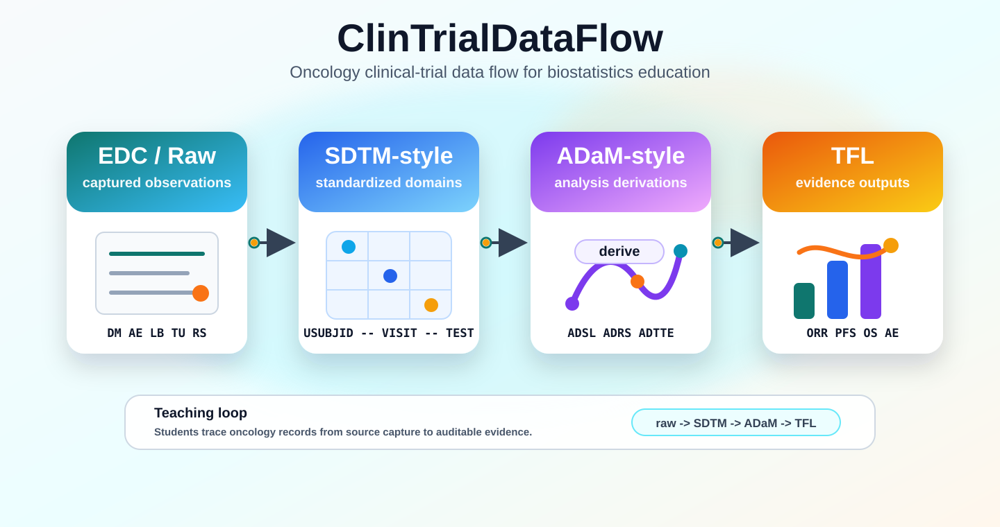

# SDTM Delivery Accelerator

Medium Article - https://medium.com/@rhiriyappa/from-raw-edc-to-validated-submission-architecting-an-enterprise-sdtm-accelerator-for-cros-ab08ef0353ef

The pharmaceutical drug lifecycle represents the journey of bringing a novel therapeutic from initial discovery to real-world patient impact. 

It begins in **Academic Research**, where foundational understanding is built through basic science, preclinical laboratory or animal testing, and the development of innovative technologies. To transition these scientific discoveries into viable therapeutics, **Translational & Collaborative Efforts** bridge the gap between academia and industry through funding, industry partnerships, and multi-phase clinical trials. Finally, the **Pharma Industry** leads the scaled drug development, manufacturing, regulatory approval, and commercialization phases—ultimately delivering new therapies to market to improve patient health outcomes.


In a clinical trial managed by a **Clinical Research Organization (CRO)**, the study life cycle dictates when and how SDTM (Study Data Tabulation Model) is planned, built, populated, and finalized for regulatory bodies like the FDA. SDTM standardizes data structures into organized domains (like Demographics or Adverse Events) to smooth review and approval.




### Study Life Cycle Phases & SDTM Integration
- **Setup & Design**: Build CDASH-compliant electronic Case Report Forms (eCRFs) in the EDC system so that raw data elements align naturally with future SDTM domains.
- **Execution & Collection**: Sites enter patient data, and external vendors supply lab or device files. Data management cleans and locks the database.
- **Mapping & Transformation**: Programmers use specifications to translate raw database structures into standard SDTM domains (e.g., Demographics DM, Adverse Events AE, Lab results LB).
- **Submission Preparation**: Generate compliance outputs including Annotated CRFs (aCRF) and define.xml datasets for health authorities like the FDA.

> Mapping clinical trial data to the SDTM manually is slow, repetitive, and prone to human error. This proposal uses AI/ML often paired with human-in-the-loop (HITL) workflows to help resolve these bottlenecks by automating semantic variable matching, generating mapping specifications, and accelerating regulatory readiness

---

## A Case Study for Demo CRO : Vanguard Global Systems (VGS)

A locally runnable proof of the single pipeline recommended:

> **Spec / CRF → Mapping → Code generation (`sdtm.oak`) → Validation → Human sign-off**

It takes 50 subjects of CDISC conforming raw EDC data, maps it to SDTM
(**DM, AE, VS, LB, CM**), runs conformance validation with an adapter to plug in
the **real CDISC CORE** engine and enforces a human-in-the-loop sign-off gate
with a 21 CFR Part 11 audit trail before anything is marked **submission ready**.

**Note**: Everything runs on a mac with Python; the production mapping path uses the real
`sdtm.oak` R package when it is installed.

This POC deliberately maps to the proposal's non-negotiables:
AI drafts, a qualified human reviews and signs, and no output clears the gate
without passing validation and human disposition - *"zero validation escapes."*

---

## Quick start

```bash
pip install -r requirements.txt

# 1) Default: map -> validate -> define.xml, then HALT at the human gate.
python3 src/run_pipeline.py

# 2) Show a scripted qualified reviewer complete the HITL flow to release.
python3 src/run_pipeline.py --simulate-signoff

# 3) Run the verification suite (24 checks incl. gate-block & tamper detection).
python3 tests/test_pipeline.py

# 4) Integrate real CDISC CORE findings into the gate (two ways):
python3 src/run_pipeline.py --core-mode auto            # runs the CORE CLI if installed
python3 src/run_pipeline.py --core-mode report \
        --core-report path/to/core_report.json          # ingest an existing CORE report
```

Default mode stops at the gate on purpose. It's the honest state after the AI
has drafted the datasets. `--simulate-signoff` plays a scripted reviewer so you
can watch an end-to-end release without needing three real people.

---

## The pipeline, stage by stage

| Stage | Reference | Implementation |
|---|---|---|
| **Raw EDC source** | CDISC data, EDC (RACI, p10) | `src/generate_edc.py` → `data/raw_edc/*.csv` (50 subjects across 5 domains, DD-MON-YYYY, wide vitals/labs, seeded defects) |
| **Spec / CRF** | Init 1 mapping front-end | `specs/*.yaml` — declarative mapping specs consumed by both engines |
| **Mapping / code-gen** | Init 2, `sdtm.oak` (R) | `R/map_sdtm_oak.R` (real oak verbs) + `src/oak_wrapper.py` (Python wrapper) + `src/py_oak_engine.py` (local fallback) |
| **Validation gate** | P21 / CDISC CORE | `src/validate.py` (built-in rules) + `src/core_adapter.py` (**real CDISC CORE** integration) → one rule-ID/severity report (Excel + HTML + JSON) |
| **Independent QC** | ≥99% QC parity (p9) | `src/qc_reference.py` — independent double-programming |
| **Human sign-off** | HITL always (p6) | `src/signoff.py` — review queue, disposition, e-signature gate |
| **Audit trail** | full audit trail (p6, p9) | `src/audit.py` — tamper-evident hash-chained log |
| **Submission metadata** | submission-grade deliverable | `src/define_xml.py` → `define.xml` (Define-XML 2.1 stub) + XPT transport files |


## Domains mapped

| Domain | SDTM class | Notable mapping patterns exercised |
|---|---|---|
| **DM** | Special Purpose | CT (SEX/RACE/ETHNIC), ISO dates, USUBJID derivation |
| **AE** | Events | `--SEQ`, MedDRA-coding HITL, event date-logic checks |
| **VS** | Findings | wide→tall pivot, standardized results/units |
| **LB** | Findings | wide→tall + units + reference ranges + derived `LBNRIND` (NORMAL/HIGH/LOW) + critical-value HITL |
| **CM** | Interventions | CT (ROUTE/UNIT), dose, WHODrug-coding HITL, date-logic checks |


## Mapping engine: `sdtm.oak` + Python wrapper

`oak_wrapper.py` selects the engine transparently:

- **`--engine R`** shells out to `R/map_sdtm_oak.R`, which uses the real
  pharmaverse `sdtm.oak` verbs (`hardcode_no_ct`, `assign_no_ct`, `assign_ct`,
  `create_iso8601`, `derive_seq`). This is the production path.
- **`--engine python`** runs `py_oak_engine.py`, a faithful pure-Python
  re-implementation of the same oak primitives, driven by the *same* YAML specs.
  Zero R dependency, so the pipeline always runs locally.
- **`--engine auto`** (default) uses R + `sdtm.oak` if present, else Python.

Both engines emit identical columns, so validation and sign-off are
engine-agnostic. The Python path is a valid local stand-in for demoing and
testing; the R path is what you would validate for GxP use.


## CDISC CORE integration (`src/core_adapter.py`)

Per the requirement — *"Don't rebuild validation, leverage it ... integrate CDISC CORE
as the compliance gate rather than reinventing it"* — the built-in rules engine
is only the harness. `core_adapter.py` plugs in the **real** open-source CORE
engine and merges its findings into the same report and the same human gate,
tagged `source="CDISC CORE"`.

CORE runs **out of process via its CLI**, never imported here — deliberately,
because the `cdisc-rules-engine` package pins old pandas/numpy and conflicts with
a modern analysis stack. Two integration modes:

- **`--core-mode auto`** — runs the `core` CLI if it's installed and a rules
  cache is present (`core update-cache` needs a CDISC Library API key). If not,
  the adapter reports unavailable and the pipeline continues on the built-in
  engine — same graceful fallback as R-vs-Python mapping.
- **`--core-mode report --core-report <file>`** — ingests a CORE JSON report
  produced elsewhere (e.g. in a validated environment). This is the most robust
  way to bind real CORE findings into the gate and is fully offline-testable
  (`tests/fixtures/sample_core_report.json`).


## The human-in-the-loop gate

`submission_ready` is `True` only when **all three** conditions hold, each
independently recorded in the audit trail:

1. **No open ERRORs** — every error is resolved at source (data query + re-derive)
   or justified as a false positive. Errors can never be silently waived.
2. **No open WARNINGs** — every warning is dispositioned by a human (MedDRA
   coding, clinical query, confirm-acceptable, or false-positive). This is the
   mechanism behind *zero validation escapes*.
3. **Required e-signatures present** — `mapping_review`, `validation_gate`, and
   `submission_release`, each from a role authorized in `config/study.yaml` and
   each bound to the SHA-256 fingerprint of the exact datasets signed.

Findings use **content-addressed IDs** (a hash of the finding, not a row number),
so a disposition binds to a finding's identity and a stale disposition can never
clear a regenerated error after a rerun.


## Seeded data quality defects (so the review has real work)

| Subject | Defect | Caught as | Human action in the demo |
|---|---|---|---|
| 0021 | AE onset date after resolution date | ERROR `VGS0050` | data query → corrected at source → re-derived |
| 0033 | Systolic BP = 400 (implausible) | WARNING `VGS0070` | site query raised |
| 0015 | Lab ALT = 999 (critical value) | WARNING `VGS0071` | clinical query raised |
| ~15% of AEs | AE term not MedDRA-coded | WARNING `VGS0060` | medical coder assigns PT |
| ~15% of CMs | Med not WHODrug-coded | WARNING `VGS0061` | drug coder assigns term |
| 0044 | Blank race | mapped to CT `UNKNOWN` | (default applied, visible in manifest) |


## Governance metrics

Computed every run and checked against `config/study.yaml` thresholds:

- **Domain accuracy** = 1 − (records with ≥1 ERROR / total) — target ≥ 0.90
- **QC parity** = cell-level agreement vs the independent reference — target ≥ 0.99


## Outputs

```
outputs/sdtm/       dm|ae|vs|lb|cm .csv + .xpt, qc/*_qc.csv, mapping_manifest.json
outputs/reports/    validation_report.xlsx / .html, validation_findings.csv,
                    validation_results.json, core_report.json (if CORE ran)
outputs/signoff/    audit_trail.jsonl, review_state.json,
                    validation_dossier.json / .html, define.xml

```
## What is real vs. simulated

- **Real:** the mapping logic, ISO-8601/CT/pivot transforms, the validation rules
  engine, independent QC double programming, the hash chained audit trail, the
  e-signature authorization model, and the gate logic. All verified by tests.
- **Simulated for local demo:** the raw EDC data (synthetic, seeded), the three
  human reviewers in `--simulate-signoff` (a real deployment wires the review
  queue to actual named reviewers), and — unless R is installed — the mapping
  runs on the Python oak engine rather than the R `sdtm.oak` package.
- **Real CDISC CORE, when configured:** `core_adapter.py` runs the actual CORE
  engine and merges its findings into the gate. The built-in rules remain as a
  fast, always available default (and mimic P21/CORE output shape); they are the
  harness, and CORE is the authoritative gate once its rules cache is set up.
- **Pinnacle 21** is commercial and is not bundled; the same adapter pattern
  (subprocess + normalize into the finding model) is how P21 would be wired in.


## Next steps toward the roadmap

1. Configure the CORE rules cache (CDISC Library API key) and run `--core-mode auto`
   in CI so every build is gated by real CORE rules.
2. Run `--engine R` on a validated `sdtm.oak` install; confirm Python↔R parity.
3. Wire the review queue to real reviewer identities + SSO for Part 11 signatures.
4. Benchmark **hours saved** vs. a **manually programmed study** (the p7 GO/NO-GO gate).


## References

CDISC Primer - https://www.cdisc.org/sites/default/files/pdf/CDISC-PHUSE-SlidesMERGED.pdf
SDTM - https://www.cdisc.org/standards/foundational/sdtm
